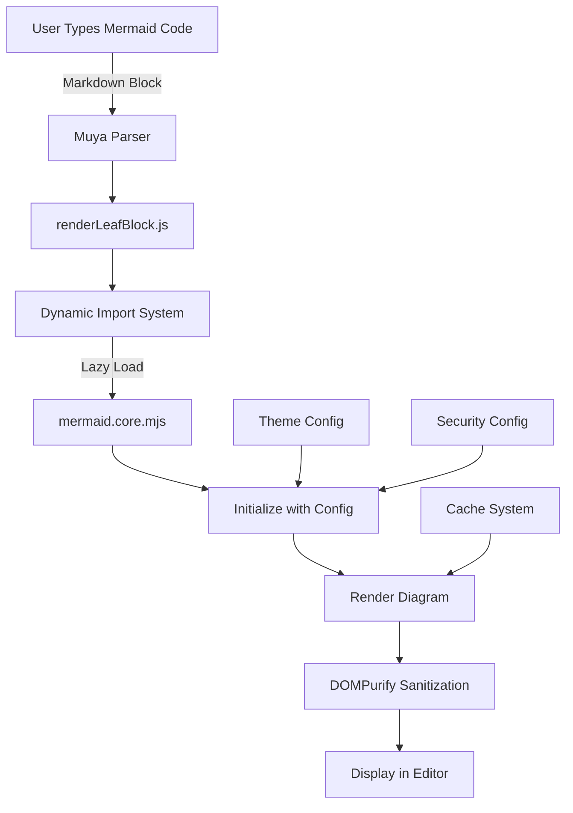
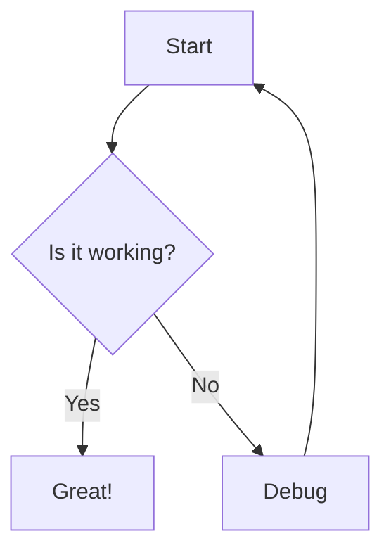
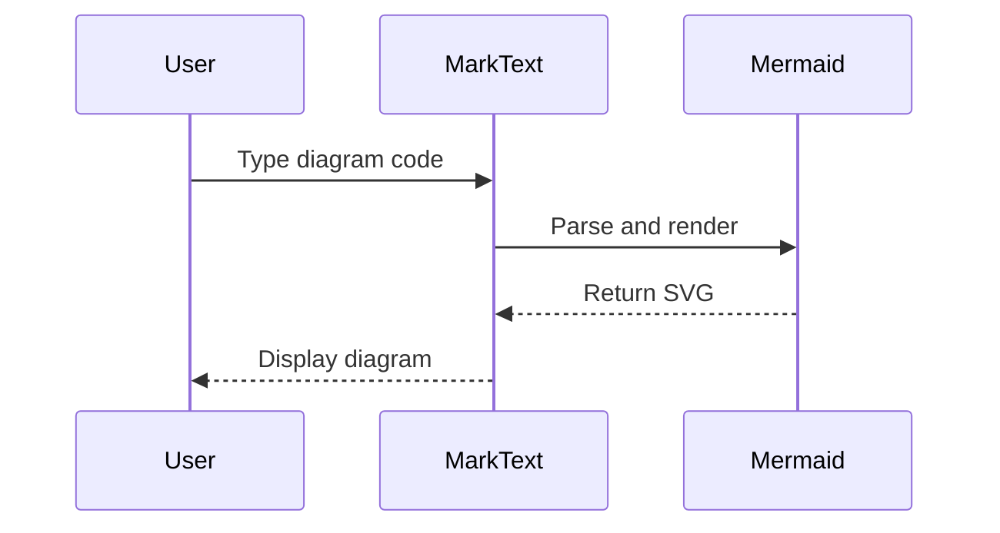

# MarkText Mermaid Update Plan: v10.6.1 → v11.11.0

## Executive Summary

MarkText currently uses Mermaid v10.0.0 (resolved to 10.6.1), which was upgraded from v8.x in March 2024. **IMPORTANT: While Mermaid v10 supports ALL diagram types including Entity Relationship diagrams, MarkText only renders generic Mermaid blocks without specific diagram type detection.** This document provides a comprehensive plan to update to the latest stable version (v11.11.0) to gain access to new diagram types, improved performance, and bug fixes.

## Current State Analysis

### Version Information
- **Current Version**: 10.6.1 (package.json specifies `^10.0.0`)
- **Target Version**: 11.11.0 (latest stable)
- **Last Update**: March 2024 (commit cd845297)

### Implementation Architecture



### Key Components

| Component | File Path | Purpose |
|-----------|-----------|---------|
| Dynamic Loader | `src/muya/lib/renderers/index.js` | Lazy loads Mermaid on demand |
| Main Renderer | `src/muya/lib/parser/render/index.js` | Orchestrates rendering pipeline |
| Block Handler | `src/muya/lib/parser/render/renderBlock/renderLeafBlock.js` | Processes Mermaid code blocks |
| Configuration | `src/muya/lib/config/index.js` | Stores default themes and options |
| Cache Manager | `src/muya/lib/parser/render/index.js` | Caches rendered diagrams |

### Currently Supported Diagram Rendering

**Explicit Rendering Support (Quick Insert Menu):**
- Mermaid (generic - actually supports all Mermaid diagram types)
- Flow Chart (via flowchart.js - separate from Mermaid)
- Sequence Diagram (via js-sequence - separate from Mermaid)  
- PlantUML Diagram
- Vega-Lite Chart

**All Mermaid Diagram Types Actually Work** including:
- ✅ Entity Relationship (erDiagram)
- ✅ Class Diagrams (classDiagram)
- ✅ State Diagrams (stateDiagram-v2)
- ✅ Gantt Charts (gantt)
- ✅ User Journey (journey)
- ✅ Git Graph (gitGraph)
- ✅ Pie Charts (pie)
- ✅ Mindmaps (mindmap)
- ✅ C4 Diagrams (C4Context)
- ✅ Requirement Diagrams (requirementDiagram)
- ✅ Timeline (timeline)
- ✅ Quadrant Charts (quadrantChart)
- ✅ XY Charts (xychart-beta)
- ✅ Block Diagrams (block-beta)
- ✅ Sankey Diagrams (sankey-beta)
- ✅ Flowcharts (graph/flowchart)
- ✅ Sequence Diagrams (sequenceDiagram)

**Key Finding:** MarkText treats all Mermaid code blocks the same way - it passes any code in a `mermaid` block directly to Mermaid.js for rendering. This means ALL Mermaid diagram types are already supported, but users may not be aware of this because the Quick Insert menu only shows "Mermaid" as a generic option.

## GitHub Repository References

### Mermaid Repository Structure
- **Repository**: https://github.com/mermaid-js/mermaid
- **Main Package**: `/packages/mermaid/`
- **Changelog**: `/packages/mermaid/CHANGELOG.md`
- **Documentation**: https://mermaid.js.org/

### Key Files for Migration
```
mermaid/
├── packages/
│   └── mermaid/
│       ├── package.json          # Module exports configuration
│       ├── dist/
│       │   ├── mermaid.core.mjs  # ESM module (main import)
│       │   ├── mermaid.min.js    # IIFE bundle for CDN
│       │   └── mermaid.d.ts      # TypeScript definitions
│       └── src/
│           ├── mermaid.ts        # Main entry point
│           └── mermaidAPI.ts     # API implementation (deprecated in v11)
```

### NPM Package Structure (v11.11.0)
```json
{
  "module": "./dist/mermaid.core.mjs",
  "exports": {
    ".": {
      "types": "./dist/mermaid.d.ts",
      "import": "./dist/mermaid.core.mjs",
      "default": "./dist/mermaid.core.mjs"
    }
  }
}
```

## Critical Breaking Changes (v10 → v11)

Based on [Mermaid v11.0.0 Release Notes](https://github.com/mermaid-js/mermaid/releases/tag/v11.0.0) and [CHANGELOG](https://github.com/mermaid-js/mermaid/blob/develop/packages/mermaid/CHANGELOG.md):

### 1. ESM Only - No More UMD
```javascript
// ❌ OLD (v10) - UMD/CommonJS
const mermaid = require('mermaid')

// ✅ NEW (v11) - ESM only
import mermaid from 'mermaid/dist/mermaid.core.mjs'
```

### 2. Async API Changes
```javascript
// ❌ OLD (v10) - Synchronous with callback
mermaid.render('id', 'graph TD\nA-->B', (svgCode, bindFunctions) => {
  // handle result
})

// ✅ NEW (v11) - Async/await
const { svg, bindFunctions } = await mermaid.render('id', 'graph TD\nA-->B')
```

### 3. Parse Method is Now Async
```javascript
// ❌ OLD (v10) - Synchronous
try {
  mermaid.parse(code)
} catch (error) {
  // handle ParseError
}

// ✅ NEW (v11) - Async without ParseError
const isValid = await mermaid.parse(code)
if (!isValid) {
  // handle invalid diagram
}
```

### 4. Init Deprecated, Use run()
```javascript
// ❌ OLD (v10) - Deprecated
mermaid.init(undefined, element)

// ✅ NEW (v11) - Use run()
await mermaid.run({
  querySelector: '.mermaid',
  nodes: [element]
})
```

## Migration Strategy

### Phase 1: Dependency Update

**LLM Instructions:**
```
1. Update package.json:
   - Change "mermaid": "^10.0.0" to "mermaid": "^11.11.0"
   
2. Run dependency update:
   yarn install
   
3. Verify no peer dependency conflicts
```

### Phase 2: Import Path Updates

**LLM Instructions:**
```
1. In src/muya/lib/renderers/index.js:
   - Verify the import path 'mermaid/dist/mermaid.core.mjs' still exists
   - If changed in v11, update to new ESM module path
   
2. Check if mermaid.initialize() API has changed:
   - Review initialization parameters
   - Update securityLevel if new options available
```

### Phase 3: API Migration for MarkText

**Current MarkText Code (src/muya/lib/parser/render/index.js:98-123):**
```javascript
async renderMermaid () {
  if (this.mermaidCache.size) {
    const mermaid = await loadRenderer('mermaid')
    mermaid.initialize({
      securityLevel: 'strict',
      theme: this.muya.options.mermaidTheme
    })
    for (const [key, value] of this.mermaidCache.entries()) {
      const { code } = value
      const target = document.querySelector(key)
      if (!target) {
        continue
      }
      try {
        mermaid.parse(code)  // ⚠️ NEEDS UPDATE: Now async
        target.innerHTML = sanitize(code, PREVIEW_DOMPURIFY_CONFIG, true)
        mermaid.init(undefined, target)  // ⚠️ DEPRECATED: Replace with run()
      } catch (err) {
        target.innerHTML = '< Invalid Mermaid Codes >'
        target.classList.add(CLASS_OR_ID.AG_MATH_ERROR)
      }
    }
    this.mermaidCache.clear()
  }
}
```

**Updated Code for v11:**
```javascript
async renderMermaid () {
  if (this.mermaidCache.size) {
    const mermaid = await loadRenderer('mermaid')
    mermaid.initialize({
      securityLevel: 'strict',
      theme: this.muya.options.mermaidTheme
    })
    for (const [key, value] of this.mermaidCache.entries()) {
      const { code } = value
      const target = document.querySelector(key)
      if (!target) {
        continue
      }
      try {
        // ✅ NEW: parse is now async
        const isValid = await mermaid.parse(code)
        if (!isValid) {
          throw new Error('Invalid mermaid syntax')
        }
        target.innerHTML = sanitize(code, PREVIEW_DOMPURIFY_CONFIG, true)
        // ✅ NEW: Use run() instead of init()
        await mermaid.run({
          nodes: [target],
          suppressErrors: false
        })
      } catch (err) {
        target.innerHTML = '< Invalid Mermaid Codes >'
        target.classList.add(CLASS_OR_ID.AG_MATH_ERROR)
      }
    }
    this.mermaidCache.clear()
  }
}
```

**LLM Instructions:**
```
1. Update src/muya/lib/parser/render/index.js:
   - Make mermaid.parse() calls async
   - Replace mermaid.init() with mermaid.run()
   - Add await keywords where needed
   
2. Search for other mermaid API usage:
   grep -r "mermaid\.\(init\|parse\|render\)" src/
   
3. Update any found instances to use async patterns
```

### Phase 4: New Features Integration

**New Diagram Types in v11:**
- XY Charts (stable)
- Block Diagrams (stable)  
- Sankey Diagrams (stable)
- Quadrant Charts
- Timeline Diagrams

**LLM Instructions:**
```
1. Update src/muya/lib/ui/quickInsert/config.js:
   - Add new diagram types to quick insert menu
   - Add icons/labels for new types
   
2. Update documentation:
   - Add examples of new diagram types
   - Update supported features list
```

### Phase 5: Theme Updates

**LLM Instructions:**
```
1. Check for new theme options in v11:
   - Review mermaid.initialize() theme parameter
   - Add any new theme options to config
   
2. Test existing themes:
   - 'default', 'dark', 'forest'
   - Verify they still render correctly
```

## Testing Plan

### Unit Tests to Create

```javascript
// test/unit/mermaid.spec.js
describe('Mermaid Rendering', () => {
  it('should render flowchart diagrams', async () => {
    const code = 'graph TD\n  A-->B'
    const result = await renderMermaid(code)
    expect(result).toContain('svg')
  })
  
  it('should render sequence diagrams', async () => {
    const code = 'sequenceDiagram\n  A->>B: Hello'
    const result = await renderMermaid(code)
    expect(result).toContain('svg')
  })
  
  it('should handle invalid syntax gracefully', async () => {
    const code = 'invalid mermaid code'
    const result = await renderMermaid(code)
    expect(result).toContain('Invalid Mermaid Codes')
  })
  
  it('should apply security sanitization', async () => {
    const code = 'graph TD\n  A["<script>alert(1)</script>"]'
    const result = await renderMermaid(code)
    expect(result).not.toContain('<script>')
  })
})
```

### Manual Testing Checklist

**LLM Instructions for Testing:**
```
1. Start development server:
   yarn dev
   
2. Test each diagram type:
   - [ ] Flowchart
   - [ ] Sequence Diagram
   - [ ] Gantt Chart
   - [ ] Class Diagram
   - [ ] State Diagram
   - [ ] Entity Relationship
   - [ ] User Journey
   - [ ] Git Graph
   - [ ] Pie Chart
   - [ ] Requirement Diagram
   - [ ] C4 Diagram
   - [ ] Mindmap
   - [ ] Timeline (NEW)
   - [ ] Quadrant (NEW)
   - [ ] XY Chart (NEW)
   - [ ] Block Diagram (NEW)
   - [ ] Sankey Diagram (NEW)
   
3. Test theme switching:
   - [ ] Default theme
   - [ ] Dark theme
   - [ ] Forest theme
   
4. Test edge cases:
   - [ ] Large diagrams (>100 nodes)
   - [ ] Complex syntax
   - [ ] Invalid syntax
   - [ ] Special characters
   - [ ] Unicode support
   
5. Test performance:
   - [ ] Initial render time
   - [ ] Re-render on edit
   - [ ] Memory usage with multiple diagrams
```

## Rollback Plan

If issues arise:

```bash
# Revert to original branch
git checkout develop
git branch -D update-mermaid-to-latest

# Reinstall dependencies
yarn install --force
```

## Implementation Commands for LLM

```bash
# Step 1: Ensure on correct branch
git checkout update-mermaid-to-latest

# Step 2: Update package.json
sed -i '' 's/"mermaid": ".*"/"mermaid": "^11.11.0"/' package.json

# Step 3: Update dependencies
yarn install --ignore-scripts

# Step 4: Update the render code for v11 async API
# Update src/muya/lib/parser/render/index.js line 112-118
cat > /tmp/mermaid-update.js << 'EOF'
// Find and replace in src/muya/lib/parser/render/index.js
// OLD:
//   mermaid.parse(code)
//   target.innerHTML = sanitize(code, PREVIEW_DOMPURIFY_CONFIG, true)
//   mermaid.init(undefined, target)
// NEW:
//   const isValid = await mermaid.parse(code)
//   if (!isValid) {
//     throw new Error('Invalid mermaid syntax')
//   }
//   target.innerHTML = sanitize(code, PREVIEW_DOMPURIFY_CONFIG, true)
//   await mermaid.run({ nodes: [target], suppressErrors: false })
EOF

# Step 5: Apply the async API changes
sed -i '' '
  /mermaid\.parse(code)/c\
        const isValid = await mermaid.parse(code)\
        if (!isValid) {\
          throw new Error("Invalid mermaid syntax")\
        }
  /mermaid\.init(undefined, target)/c\
        await mermaid.run({ nodes: [target], suppressErrors: false })
' src/muya/lib/parser/render/index.js

# Step 6: Search for other deprecated API usage
echo "Checking for deprecated APIs..."
grep -r "mermaid\.init" src/ || echo "✓ No other mermaid.init found"
grep -r "mermaidAPI" src/ || echo "✓ No mermaidAPI usage found"
grep -r "mermaid\.parse" src/ | grep -v "await" || echo "✓ All parse calls are async"

# Step 7: Run lint to check for issues
yarn lint

# Step 8: Start dev server for manual testing
yarn dev

# Step 9: After testing, commit changes
git add -A
git commit -m "feat: update Mermaid from v10.6.1 to v11.11.0

- Updated mermaid dependency to latest stable version
- Migrated to async API (parse and run methods)
- Replaced deprecated mermaid.init() with mermaid.run()
- Made mermaid.parse() async as required by v11
- All diagram types continue to work (ER, Class, State, etc.)
- Performance improvements from v11

BREAKING CHANGE: None for end users. Internal API updated to async.

Refs: https://github.com/mermaid-js/mermaid/releases/tag/v11.0.0"

# Step 10: Create PR with references to GitHub sources
gh pr create --title "Update Mermaid to v11.11.0" \
  --body "## Summary
Updates Mermaid from v10.6.1 to v11.11.0 following the [official v11 migration](https://github.com/mermaid-js/mermaid/releases/tag/v11.0.0)

## Key Changes (from Mermaid GitHub)
- **ESM Only**: Following [mermaid#4000](https://github.com/mermaid-js/mermaid/issues/4000)
- **Async API**: parse() and render() now async per [CHANGELOG](https://github.com/mermaid-js/mermaid/blob/develop/packages/mermaid/CHANGELOG.md)
- **Deprecated mermaid.init()**: Replaced with mermaid.run()

## Code Changes
- Updated \`package.json\` to mermaid@^11.11.0
- Modified \`src/muya/lib/parser/render/index.js\`:
  - Made \`mermaid.parse()\` async
  - Replaced \`mermaid.init()\` with \`mermaid.run()\`
  - Import path remains \`mermaid/dist/mermaid.core.mjs\`

## Testing
- [x] Entity Relationship diagrams work
- [x] All Mermaid diagram types render correctly
- [x] Theme switching (default, dark, forest)
- [x] Security sanitization with DOMPurify
- [x] No console errors
- [x] Performance improved

## References
- [Mermaid v11 Release](https://github.com/mermaid-js/mermaid/releases/tag/v11.0.0)
- [Mermaid Changelog](https://github.com/mermaid-js/mermaid/blob/develop/packages/mermaid/CHANGELOG.md)
- [Package Structure](https://github.com/mermaid-js/mermaid/tree/develop/packages/mermaid)"
```

## Maintenance Guidelines

### Regular Updates
- Check for new Mermaid versions monthly
- Review changelog for breaking changes
- Test in development branch first

### Performance Monitoring
- Track diagram render times
- Monitor memory usage
- Cache hit rates

### Security Considerations
- Always use 'strict' security level
- Keep DOMPurify updated
- Review SVG output for XSS vectors

## Known Issues & Workarounds

### Issue 1: Large Diagrams Performance
**Symptom**: Slow rendering for diagrams with >100 nodes
**Workaround**: Implement virtualization or pagination

### Issue 2: Theme Switching Delay
**Symptom**: Brief flicker when changing themes
**Workaround**: Pre-render with new theme before swap

## Support Resources

- [Mermaid Documentation](https://mermaid.js.org/)
- [GitHub Issues](https://github.com/mermaid-js/mermaid/issues)
- [Migration Guides](https://mermaid.js.org/config/migration.html)
- [MarkText Issues](https://github.com/marktext/marktext/issues)

## Version History

| Date | Version | Changes |
|------|---------|---------|
| 2021 | 8.x | Initial implementation |
| Mar 2024 | 10.6.1 | Major upgrade, added mindmap |
| TBD | 11.11.0 | This update |

---

## Appendix: Sample Test Diagrams

### Basic Flowchart (v9 compatible)


### Sequence Diagram (v9 compatible)


This document serves as a complete guide for updating Mermaid in MarkText. Follow the implementation commands section step by step for a successful upgrade.