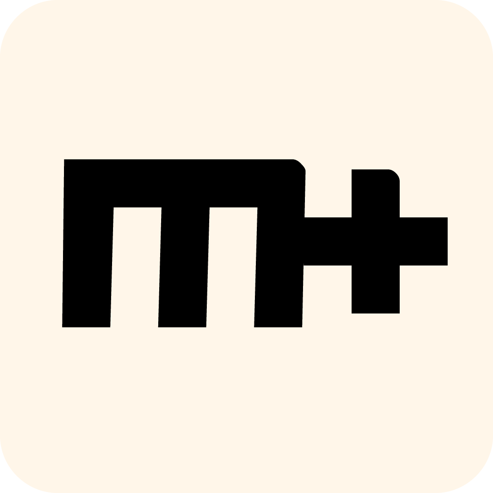

<p align="center"></p>

<h1 align="center">MarkText</h1>

<div align="center">
  <a href="https://twitter.com/intent/tweet?via=marktextme&url=https://github.com/marktext/marktext/&text=What%20do%20you%20want%20to%20say%20to%20app?&hashtags=happyMarkText">
    
  </a>
</div>
<div align="center">
  <strong>:high_brightness: Next generation markdown editor :crescent_moon:</strong><br>
  A simple and elegant open-source markdown editor that focused on speed and usability.<br>
  <sub>Available for Linux, macOS and Windows.</sub>
</div>

<br>

<div align="center">
  <!-- License -->
  <a href="LICENSE">
    
  </a>
  <!-- Build Status -->
  <a href="https://travis-ci.org/marktext/marktext/">
    
  </a>
  <a href="https://ci.appveyor.com/project/marktext/marktext/branch/master">
    
  </a>
  <!-- Downloads total -->
  <a href="https://github.com/marktext/marktext/releases">
    
  </a>
  <!-- Downloads latest release -->
  <a href="https://github.com/marktext/marktext/releases/latest">
    
  </a>
  <!-- sponsors -->
  <a href="https://opencollective.com/marktext">
    
  </a>
</div>

<div align="center">
  <h3>
    <a href="https://github.com/marktext/marktext">
      Website
    </a>
    <span> | </span>
    <a href="https://github.com/marktext/marktext#features">
      Features
    </a>
    <span> | </span>
    <a href="https://github.com/marktext/marktext#download-and-installation">
      Downloads
    </a>
    <span> | </span>
    <a href="https://github.com/marktext/marktext#development">
      Development
    </a>
    <span> | </span>
    <a href="https://github.com/marktext/marktext#contribution">
      Contribution
    </a>
  </h3>
</div>

<div align="center">
  <sub>Translations:</sub>
  <a href="docs/i18n/zh_cn.md#readme">
    <span>:cn:</span>
  </a>
  <a href="docs/i18n/zh_tw.md#readme">
    <span>:taiwan:</span>
  </a>
  <a href="docs/i18n/pl.md#readme">
    <span>:poland:</span>
  </a>
  <a href="docs/i18n/ja.md#readme">
    <span>:jp:</span>
  </a>
  <a href="docs/i18n/french.md#readme">
    <span>:fr:</span>
  </a>
  <a href="docs/i18n/tr.md#readme">
    <span>:tr:</span>
  </a>
  <a href="docs/i18n/spanish.md#readme">
    <span>:es:</span>
  </a>
  <a href="docs/i18n/pt.md#readme">
    <span>:portugal:</span>
  </a>
  <a href="docs/i18n/ko.md#readme">
    <span>:kr:</span>
  </a>
</div>

<div align="center">
  <sub>This Markdown editor that could. Built with ❤︎ by
    <a href="https://github.com/Jocs">Jocs</a> and
    <a href="https://github.com/marktext/marktext/graphs/contributors">
      contributors
    </a>
    .
  </sub>
</div>

<br />

<h2 align="center">Supporting MarkText</h2>

MarkText is an MIT licensed open source project, and the latest version will always be downloadable for free from the GitHub release page. MarkText is still in development, and its development is inseparable from all sponsors. I hope you join them:

- [Become a backer or sponsor on Patreon](https://www.patreon.com/ranluo) or [One time donation](https://github.com/Jocs/sponsor.me)
- [Become a backer or sponsor on Open Collective](https://opencollective.com/marktext)

##### What's the difference between Patreon and Open Collective?

Patreon: Funds will be directly sponsored to Luo Ran (@jocs) who created MarkText and continues to maintain it.
Open Collective: All expenses are transparent. The funds will be used for the development and maintenance of MarkText, funding online and offline activities, and acquiring other necessary resources.
Names and company logos of all sponsors (from both Patreon and Open Collective) will appear on the official website for MarkText and in its README.md file.

**Special Sponsors**

<a href="https://www.dogedoge.com/">
 
</a>

**Platinum Sponsors**

<a href="https://opencollective.com/marktext#platinum-sponsors">
 
</a>

**Gold Sponsors**

<a href="https://opencollective.com/marktext#platinum-sponsors">
  
</a>

**Silver Sponsors**

<a href="https://opencollective.com/marktext#platinum-sponsors">
  
</a>

**Bronze Sponsors**

<a href="https://opencollective.com/marktext#platinum-sponsors">
  
</a>

**Backers**

<a href="https://opencollective.com/marktext#backers">
  
</a>

## Screenshot


## Features

- Realtime preview (WYSIWYG) and a clean and simple interface to get a distraction-free writing experience.
- Support [CommonMark Spec](https://spec.commonmark.org/0.29/), [GitHub Flavored Markdown Spec](https://github.github.com/gfm/) and selective support [Pandoc markdown](https://pandoc.org/MANUAL.html#pandocs-markdown).
- Markdown extensions such as math expressions (KaTeX), front matter and emojis.
- Support paragraphs and inline style shortcuts to improve your writing efficiency.
- Output **HTML** and **PDF** files.
- Various themes: **Cadmium Light**, **Material Dark** etc.
- Various editing modes: **Source Code mode**, **Typewriter mode**, **Focus mode**.
- Paste images directly from clipboard.

<h4 align="center">:crescent_moon:themes:high_brightness:</h4>

| Cadmium Light                                     | Dark                                            |
|:-------------------------------------------------:|:-----------------------------------------------:|
|   |          |
| Graphite Light                                    | Material Dark                                   |
|  |  |
| Ulysses Light                                     | One Dark                                        |
|   |      |

<h4 align="center">:smile_cat:Edit modes:dog:</h4>

| Source Code          | Typewriter               | Focus               |
|:--------------------:|:------------------------:|:-------------------:|
|  |  |  |

## Why make another editor?

1. I love writing. I have used a lot of markdown editors, yet there is still not an editor that can fully meet my needs. I don't like to be disturbed when I write by some unbearable bug. **MarkText** uses virtual DOM to render pages which has the added benefits of being highly efficient and being open source. That way anyone who loves markdown and writing can use MarkText.
2. As mentioned above, **MarkText** is completely free and open source and will be open source forever. We hope that all markdown lovers will contribute their own code and help develop **MarkText** into a popular markdown editor.
3. There are many markdown editors and all have their own merits, some have features which others don't. It's difficult to satisfy each markdown users' needs but we hope **MarkText** will be able to satisfy each markdown user as much as possible. Although the latest **MarkText** is still not perfect, we will try to make it as best as we possibly can.

## Download and Installation


|                                                                                                   |                                                                                                           |                                                                                                                         |
|:----------------------------------------------------------------------------------------------------------------------------------------------------------------------------------------------------:|:----------------------------------------------------------------------------------------------------------------------------------------------------------------------------------------------------------------:|:----------------------------------------------------------------------------------------------------------------------------------------------------------------------------------------------------------------------------:|
| [](https://github.com/marktext/marktext/releases/download/v0.17.1/marktext-x64.dmg) | [](https://github.com/marktext/marktext/releases/download/v0.17.1/marktext-setup.exe) | [](https://github.com/marktext/marktext/releases/download/v0.17.1/marktext-x86_64.AppImage) |

Want to see new features of the latest version? Please refer to [CHANGELOG](.github/CHANGELOG.md).

#### macOS

You can either download the latest `marktext-%version%.dmg` from the [release page](https://github.com/marktext/marktext/releases/latest) or install MarkText using [**homebrew cask**](https://github.com/caskroom/homebrew-cask). To use Homebrew-Cask you just need to have [Homebrew](https://brew.sh/) installed.

```bash
brew install --cask mark-text
```

#### Windows

Simply download and install MarkText via setup wizard (`marktext-setup-%version%.exe`) and choose whether to install per-user or machine wide. Alternatively, install MarkText using a package manager such as [Chocolatey](https://chocolatey.org/) or [Winget](https://docs.microsoft.com/en-us/windows/package-manager/winget/).

To use Chocolatey, you need to have [Chocolatey](https://chocolatey.org/install) installed:

```bash
choco install marktext
```

To use Winget, you need to have [Winget](https://docs.microsoft.com/en-us/windows/package-manager/winget/#install-winget) installed:

```bash
winget install marktext
```

#### Linux

Please follow the [Linux installation instructions](docs/LINUX.md).

#### Other

All binaries for Linux, macOS and Windows can be downloaded from the [release page](https://github.com/marktext/marktext/releases/latest). If a version is unavailable for your system, then please open an [issue](https://github.com/marktext/marktext/issues).

## Development

If you wish to build MarkText yourself, please check out our [build instructions](docs/dev/BUILD.md).

- [User documentation](docs/README.md)
- [Developer documentation](docs/dev/README.md)

If you have any questions regarding MarkText, you are welcome to write an issue. When doing so please use the default format found when opening an issue. Of course, if you submit a PR directly, it will be greatly appreciated.

## Integrations

- [Alfred Workflow](http://www.packal.org/workflow/mark-text): A Workflow for the macOS app Alfred: Use "mt" to open files/folder with MarkText.

## Contribution

MarkText is in development, please make sure to read the [Contributing Guide](CONTRIBUTING.md) before making a pull request. Want to add some features to MarkText? Refer to our [roadmap](https://github.com/marktext/marktext/projects) and open issues.


## Contributors

Thank you to all the people who have already contributed to MarkText[[contributors](https://github.com/marktext/marktext/graphs/contributors)].

Special thanks to @[Yasujizr](https://github.com/Yasujizr) who designed the MarkText logo.

<a href="https://github.com/marktext/marktext/graphs/contributors"></a>

## License

[**MIT**](LICENSE).

[](https://app.fossa.io/projects/git%2Bgithub.com%2Fmarktext%2Fmarktext?ref=badge_large)
