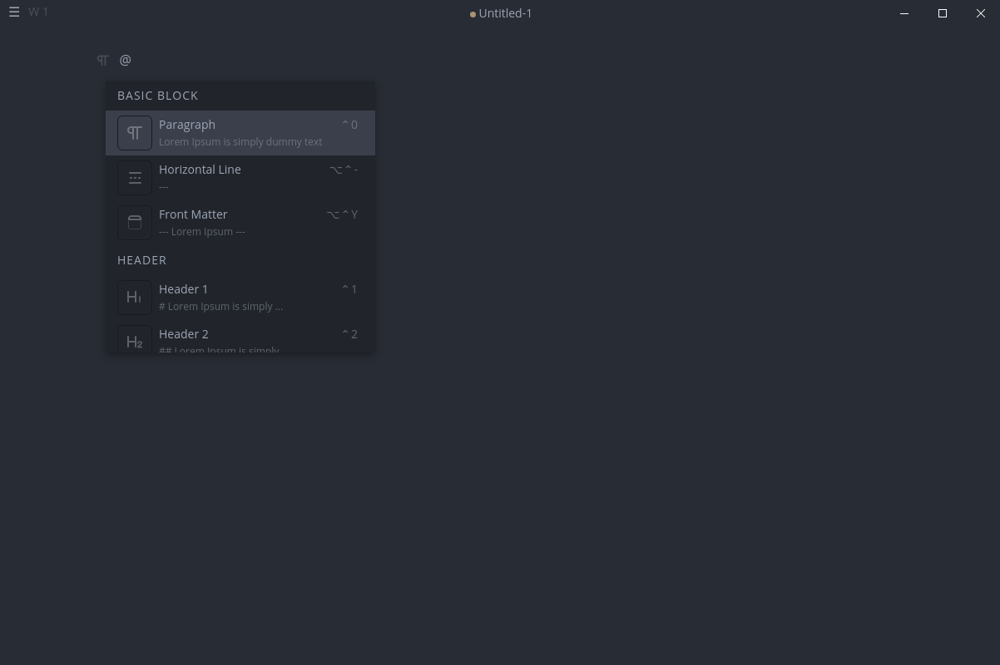
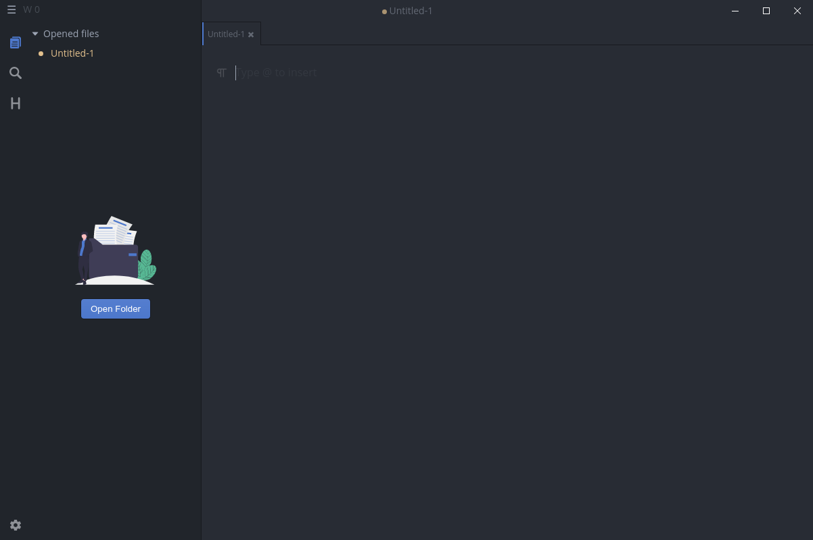
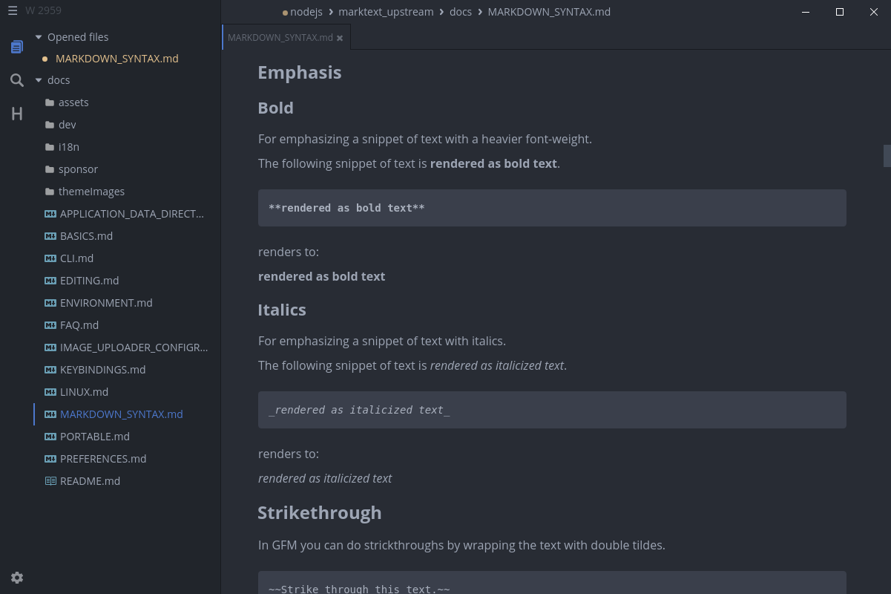
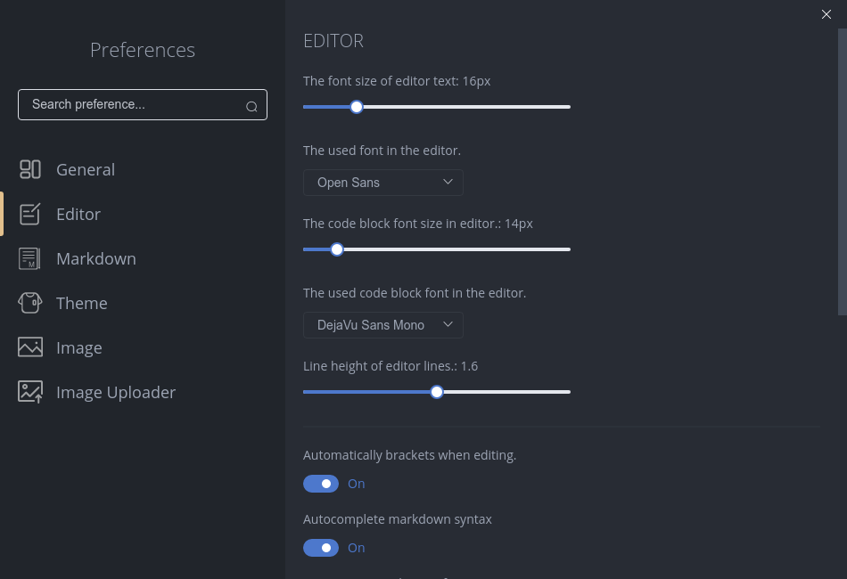

# Basics

## Getting started

MarkText is a realtime preview editor for markdown with various markdown extensions. You can simply write and edit text and MarkText hides all unnecessary syntax elements. When you first start MarkText an empty editor window is shown. You can see [key bindings](KEYBINDINGS.md) or command palette (<kbd>CmdOrCtrl</kbd>+<kbd>Shift</kbd>+<kbd>P</kbd>) for all available commands or just type `@` to get an overlay with available text elements. MarkText provides a minimal and simple interface and in the next sections you can learn more about the interface and features.

### Interface

#### Toggle sidebar

The sidebar consists of three panels and you can toggle the sidebar by pressing <kbd>CmdOrCtrl</kbd>+<kbd>J</kbd>:

- Filesystem explorer (tree view) of the opened root directory
- Find in files
- Table of contents of the selected tab

#### Toggle tabs

MarkText can be used as a single editor but opens all files in a separate tab. Tabs can be toggled via <kbd>CmdOrCtrl</kbd>+<kbd>Alt</kbd>+<kbd>B</kbd> and reordered by drag and drop.

**Want to use tabs without showing them?**

You can hide tabs and use key bindings such as <kbd>CmdOrCtrl</kbd>+<kbd>Tab</kbd> to cycle through tabs or the sidebar *opened files* panel.

#### Switch between editor modes

You can use <kbd>CmdOrCtrl</kbd>+<kbd>Alt</kbd>+<kbd>S</kbd> to switch between the preview and source-code editor. The realtime preview editor is the default editor with many features. A detailed overview of all features can be found [here](EDITING.md).

#### Typewriter and focus mode

Use <kbd>CmdOrCtrl</kbd>+<kbd>Shift</kbd>+<kbd>F</kbd> to enter distraction free focus mode or <kbd>CmdOrCtrl</kbd>+<kbd>Alt</kbd>+<kbd>T</kbd> for typewriter.

## Open and modify markdown files

### Open your first file

You can use the menu `File -> Open File` or press <kbd>CmdOrCtrl</kbd>+<kbd>O</kbd> to open a file dialog to choose a markdown file. Another way to is to launch MarkText with directories or files via command line.

### Save your edited file

After some modifications you can save your file via <kbd>CmdOrCtrl</kbd>+<kbd>S</kbd> or use *save as* to use a different file name.

### Open a directory

MarkText also has support to open a directory via <kbd>CmdOrCtrl</kbd>+<kbd>Shift</kbd>+<kbd>O</kbd> or the sidebar button *Open Folder*. After opening a directory all files and directories are shown in the sidebar tree view. The tree view allows you to open further files, browse and modify files or directories inside the opened root directory. Above the tree view are all opened files located. You can also use quick open (<kbd>CmdOrCtrl</kbd>+<kbd>P</kbd>) to quickly open a file from the opened root directory or editor and navigate via arrow keys or select a file via mouse. To view another sidebar panel like find in files click on the left sidebar icons.

## Themes

You can change the application theme by clicking on an entry under the themes application menu.

## Preferences

You can control and modify all preferences in the settings window or edit `preferences.json` in the [application data directory](APPLICATION_DATA_DIRECTORY.md). Detailed information about the preference file can be found [here](PREFERENCES.md).

- General application settings
- Settings that control the editor appearance
- Markdown related settings
- The application theme
- Options how images are handled

