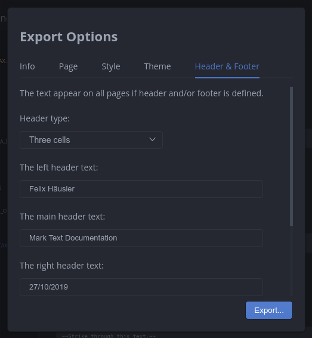
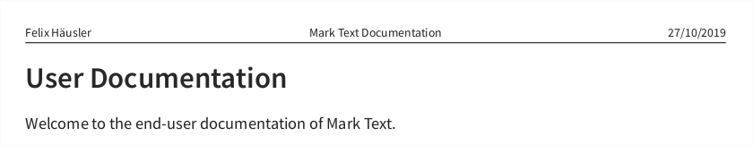

# Export a Document

MarkText allows you to export a markdown document as PDF and HTML file or to print the document.

## Options

### Page options

You can set the page size, orientation and margin before exporting a document.

### Style

Adjust the page style without modify the page theme:

- Overwrite font family, size and line height.
- Auto numbering headings.
- Option to show the front matter on the exported document.

### Theme

MarkText allows you to select a page theme before exporting. You can learn more about page themes [here](EXPORT_THEMES.md).

### Header and footer

You can include a header and/or footer in the exported document if you choose PDF or printing and also adjust the header/footer style. You can select between no, a single or a three cell header in export options. The header and/or footer appear on each page when defined and the header can be multiline but the footer only single line. Unfortunately, page numbering is currently not supported. An example can be seen below.

