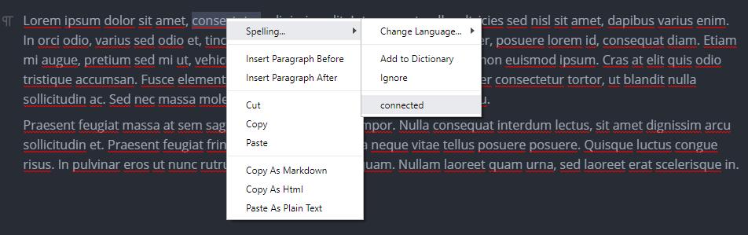
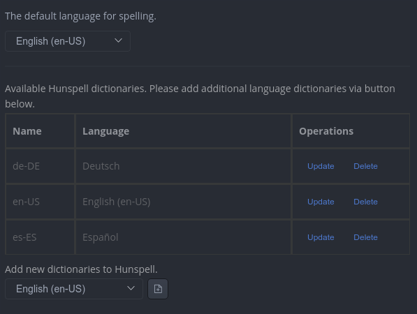

#  Spelling

MarkText can automatically check your text for misspelled words as you type and suggest corrections. You just need to enable spell checking in settings under *spelling* to never miss a misspelled word. We're using Hunspell for Linux and older Windows versions and on macOS and Window 10 you can choose between Hunspell or the system spell checker (default). You can control the default proofing language via settings but can change the language at runtime via right-click menu `Change Language` entry under `Spelling` without changing the default language. By default MarkText only support American English for Hunspell and the local available languages for the system spell checker. You can download 42 languages for Hunspell and many more for macOS and Windows 10 via system settings.

## Features

**Automatic language detection:**

MarkText can try to automatically detect the language while typing and we're currently support over 160 languages by Compact Language Detector.

**Don't underline misspelled words:**

If you don't like that all spelling mistakes are red highlighted, you can disable this feature in settings but still benefit from manually spell checking via right-click menu. Disabling constantly spell checking will also improve performance overall.

**Adding words to dictionary:**

You can add words to the selected dictionary by right-clicking on a misspelled word and select `Add to Dictionary` or remove a previously added word. If you want to temporary ignore a word, select `Ignore`.

## Manage dictionaries

### macOS spell checker

You need to add the additional language dictionaries via *"Language & Region"* in your system preferences pane.

### Windows spell checker

On Windows 10, you need to add additional language dictionaries via *"Language"* in your *"Time & language"* settings. Add the additional language(s) and download the *"Basic typing"* language option for each language.

### Hunspell

Please go to spelling settings and scroll to the bottom. Now you see a list of available language dictionaries and can add additional dictionaries via the drop-down menu at the bottom. Please note that an active internet connection is required to download a dictionary!

