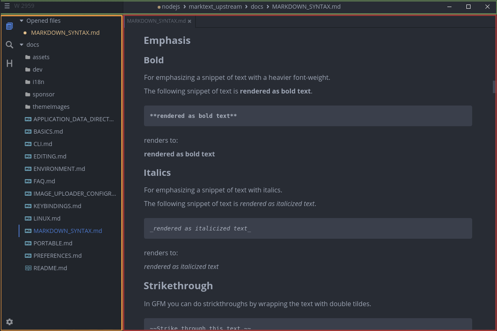

# Interface

## Main interface

- Green: titlebar
- Orange: sidebar
- Red: editor with tabs and per-tab notification at the bottom

### Titlebar

The titlebar is located at the top of the window and shows the current opened file path and the menu on Linux and Windows. On macOS we're using client-side decorations (CSD) that look similar to the picture above. On Linux and Windows there are two type of titlebar: a custom CSD that you can see in the image above and the native one.

### Sidebar

The sidebar is an optional feature of MarkText that contains three panels and has a variable width. The first pannel is a tree view of the opened root directory. The latter two are a folder searcher (find in files) that is powered by ripgrep and table of contents of the currently opened document.

### Editor

The editor is the core element that hosts the realtime preview editor called Muya and consists of three parts. Tabs are located at the top and at the bottom the per-tab notification bar is located for events like file changed or deleted. The main part is the editor that is either provided by Muya or CodeMirror for the source-code editor. There are multiple overlays available like inline toolbar, emoji picker, quick insert or image tools.
