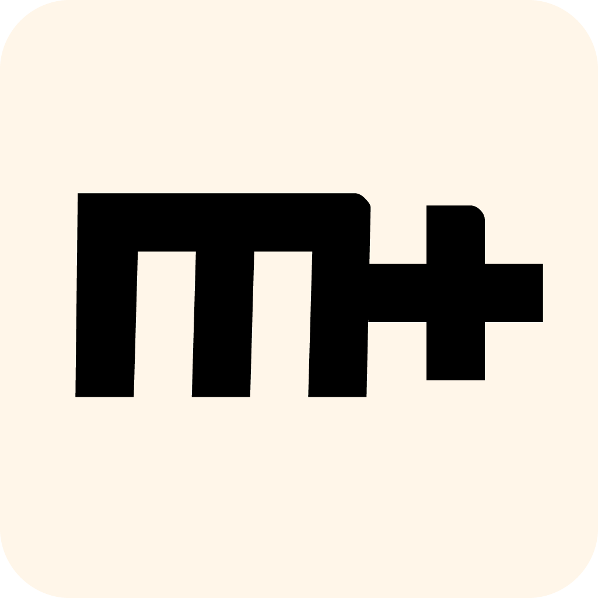
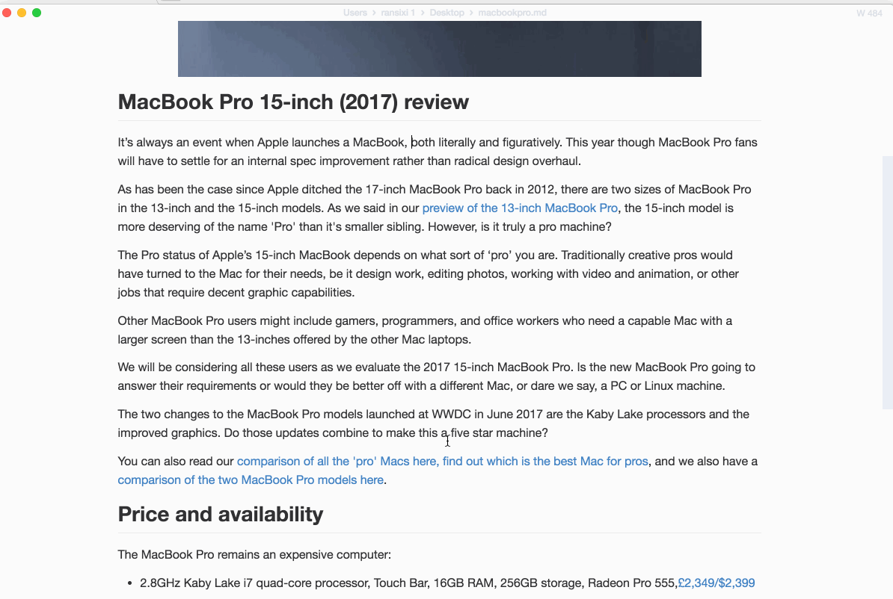
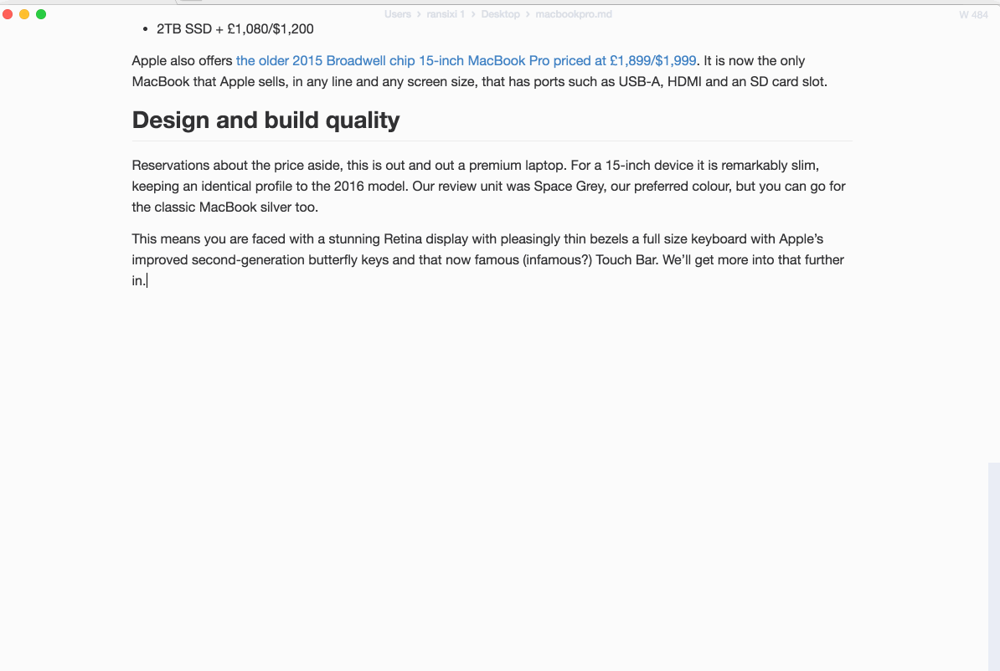
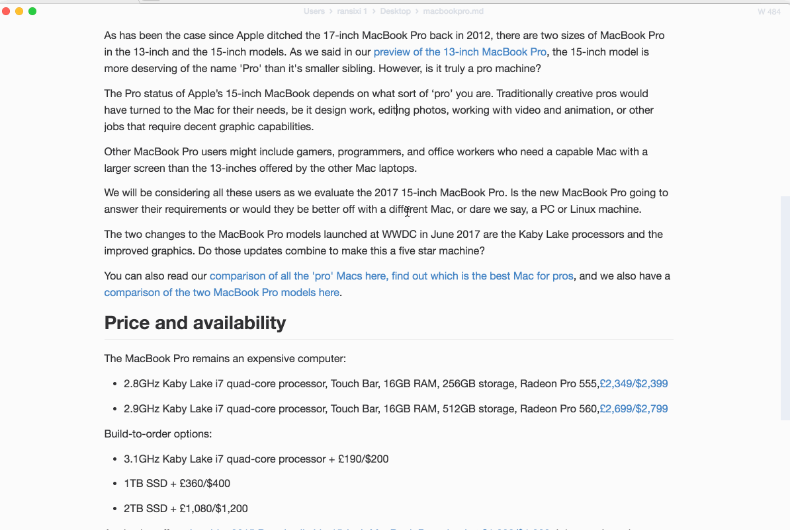

<h1 align="center">MarkText</h1>

  <strong>🔆 차세대 Markdown 편집기 🌙</strong> 
  속도와 사용성에 초점을 맞춘 심플하고 우아한 오픈 소스 Markdown 편집기입니다. 

  <!-- Latest Release Version -->
  
  <!-- Downloads total -->
  
  <!-- Downloads latest release -->
  

- [MarkText](https://github.com/marktext/marktext)는 [Jocs](https://github.com/Jocs)와 [기여자들](https://github.com/marktext/marktext/graphs/contributors)이 처음 작성한 무료 오픈 소스 Markdown 편집기입니다.

- 안타깝게도 핵심 저장소는 약 3년 전부터 유지보수가 중단됐지만, 일상 사용에서 눈에 띄는 여러 편의성 문제가 남아 있었습니다.

- 이 저장소는 내가 가장 좋아하는 Markdown 편집기를 현대화하려는 시도이며, [Jacob Whall의 포크](https://github.com/jacobwhall/marktext)를 기반으로 한 포크입니다
  - [아래의 동기](#1-soo-is-this-fork-any-different-from-the-countless-others)를 참조하세요

- 제 동기에 대해 더 자세한 내용은 아래에서 읽을 수 있습니다

# 1. 설치

> ⚠️ 이 릴리스는 아직 **베타** 단계입니다(마이그레이션 중 무엇을 얼마나 망가뜨렸는지 확신할 수 없기 때문입니다). [이슈 트래커](https://github.com/marktext/marktext/issues)에 버그를 신고해 주세요

## Windows

- [릴리스 페이지](https://github.com/marktext/marktext/releases)만 확인하시면 됩니다!

- 테스트 환경:
  - `Windows 11`

## Linux

- [릴리스 페이지](https://github.com/marktext/marktext/releases)만 확인하시면 됩니다
- 테스트 환경:
  - `Ubuntu 24.0.2` (`AppImage` 및 `.deb` 패키지)
  - _다른 Linux 패키지 테스트에 도움을 주시면 정말 좋겠습니다!_

### Linux 패키지 관리자

##### 1. Arch Linux %20marktext-bin%3E>)

- [@kromsam](https://github.com/kromsam) 덕분에 [AUR](https://aur.archlinux.org/packages/marktext-bin)에서 이용할 수 있습니다

## MacOS

> ⚠️ **공증 부족**으로 인해 MacOS 릴리스는 "`MarkText is damaged and can't be opened`"라는 메시지를 표시합니다.
> [여기 있는 해결 방법](https://github.com/marktext/marktext/issues/3004#issuecomment-1038207300)을 참고하세요(개발자 계정 서명이 없는 다른 앱에도 적용됩니다)

- [릴리스 페이지](https://github.com/marktext/marktext/releases)에서 이용할 수 있습니다

# 2. 스크린샷

# 3. ✨기능 ⭐

- 이제 **9개 언어**를 지원합니다 🆕 (특별히 [@hubo1989](https://github.com/hubo1989)께 감사드립니다)
  - `English` 🇺🇸
  - `简体中文` 🇨🇳
  - `繁體中文` 🇹🇼
  - `Deutsch` 🇩🇪
  - `Español` 🇪🇸
  - `Français` 🇫🇷
  - `日本語` 🇯🇵
  - `한국어` 🇰🇷
  - `Português` 🇵🇹

- 실시간 미리보기(WYSIWYG)와 깔끔하고 단순한 인터페이스로 방해 없는 글쓰기 경험을 제공합니다.
- [CommonMark Spec](https://spec.commonmark.org/0.29/), [GitHub Flavored Markdown Spec](https://github.github.com/gfm/)을 지원하며 [Pandoc markdown](https://pandoc.org/MANUAL.html#pandocs-markdown)을 선택적으로 지원합니다.
- 수학식(KaTeX), 프런트 매터, 이모지 등의 Markdown 확장 기능을 제공합니다.
- 문단 및 인라인 스타일 단축키를 지원해 작성 효율을 높입니다.
- **HTML** 및 **PDF** 파일로 내보낼 수 있습니다.
- 다양한 테마: **Cadmium Light**, **Material Dark** 등.
- 다양한 편집 모드: **소스 코드 모드**, **타자기 모드**, **집중 모드**.
- 클립보드에서 이미지를 바로 붙여넣을 수 있습니다.

## 3.1 🌙 테마🔆

| Cadmium Light                                   | Dark                                          |
| ----------------------------------------------- | --------------------------------------------- |
|   |          |
| Graphite Light                                  | Material Dark                                 |
|  |  |
| Ulysses Light                                   | One Dark                                      |
|   |      |

## 3.2 😸편집 모드🐶

|     소스 코드      |         타자기         |       집중        |
| :----------------: | :--------------------: | :---------------: |
|  |  |  |

# 4. 동기

## 1. 이 포크는 수많은 다른 포크와 무엇이 다른가요?

- `marktext`를 살펴보며 느꼈던 가장 큰 불만은 개발 프레임워크와 환경이 심하게 노후화되어 빌드에 시간이 너무 오래 걸린다는 점이었습니다
  - 대부분의 라이브러리가 구식이었고, 일부는 최신 버전의 Node.JS/Python에서 설치조차 되지 않았습니다

- 따라서 이 포크는 기존 `Babel + Webpack` 설정 대신 [electron-vite](https://electron-vite.org/)를 사용하는 대대적인 "재작성"에 가깝습니다
  - 목표는 가능한 한 **최신 프레임워크와 라이브러리**를 사용해 `marktext`에 **새로운 출발**을 제공하는 것입니다
  - 또한 모든 것을 `Vue3`와 `Pinia`로 마이그레이션했고, 라이브러리들도 가능한 최신 버전으로 업데이트했습니다

- `main` 및 `preload` 프로세스는 여전히 `CommonJS`로 컴파일되지만, `renderer`는 이제 완전히 **`ESModules` 전용**입니다(_마이그레이션 중 흥미로운 이슈가 있기도 했습니다_)

## 2. 멋지네요! 어떻게 도울 수 있나요?

- 다음과 같은 모든 형태가 환영입니다:
  1. 버그 테스트(버그 리포트)
  2. Pull Request

  대환영입니다!

- 아래에 이 저장소를 다루는 기본 명령 목록이 있으며, 그 외에는 디렉터리 구조가 **원본 marktext**와 매우 유사할 것입니다

## 3. 프로젝트 설정

- [개발자 문서](../dev/README.md)를 참고하세요
