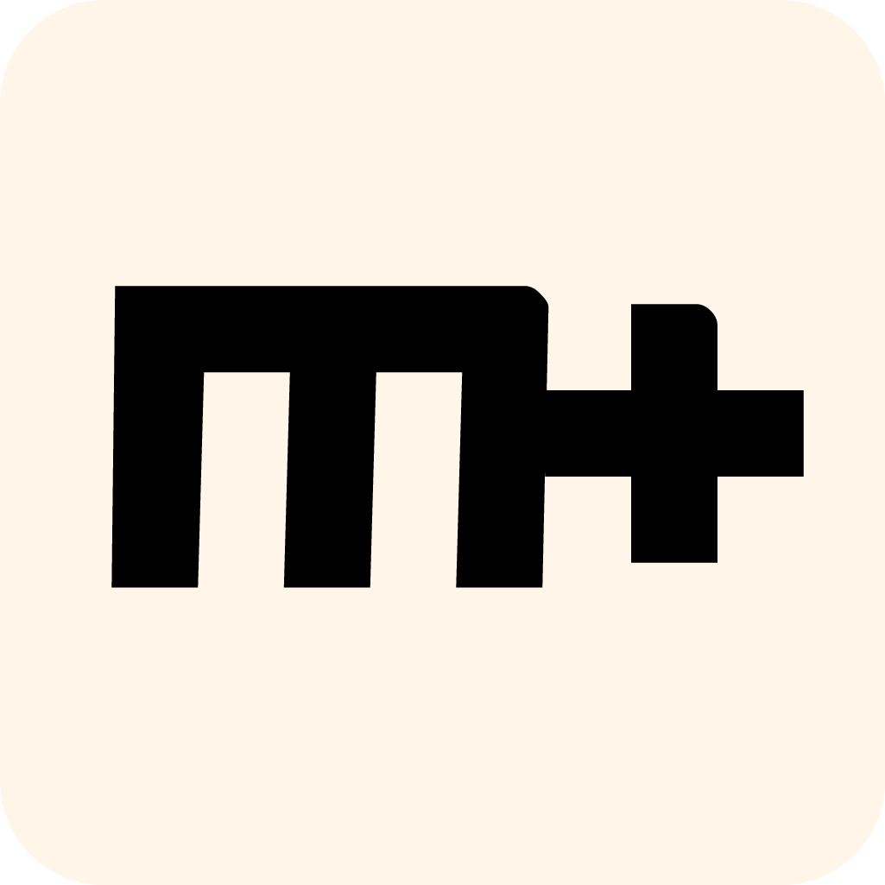

<p align="center"></p>

<h1 align="center">MarkText</h1>
<div align="center">
  <a href="https://twitter.com/intent/tweet?via=marktextme&url=https://github.com/marktext/marktext/&text=What%20do%20you%20want%20to%20say%20to%20app?&hashtags=happyMarkText">
    
  </a>
</div>

<div align="center">
  <strong>:high_brightness: 下一代 Markdown 編輯器 :crescent_moon:</strong><br>
  一個簡單優雅的 Markdown 編輯器，專注於速度和可用性。<br>
  <sub>適用於 Linux、macOS 和 Windows。</sub>
</div>


<br>

<div align="center">
  <!-- Version -->
  <a href="https://marktext.github.io/website">
    
  </a>
  <!-- License -->
  <a href="LICENSE">
    
  </a>
  <!-- Build Status -->
  <a href="https://travis-ci.org/marktext/marktext/">
    
  </a>
  <a href="https://ci.appveyor.com/project/marktext/marktext/branch/master">
    
  </a>
  <!-- Downloads total -->
  <a href="https://github.com/marktext/marktext/releases">
    
  </a>
  <!-- Downloads latest release -->
  <a href="https://github.com/marktext/marktext/releases/latest">
    
  </a>
  <!-- sponsors -->
  <a href="https://opencollective.com/marktext">
    
  </a>
</div>

<div align="center">
  <h3>
    <a href="https://github.com/marktext/marktext">
      官網
    </a>
    <span> | </span>
    <a href="https://github.com/marktext/marktext#features">
      功能
    </a>
    <span> | </span>
    <a href="https://github.com/marktext/marktext#download-and-installation">
      下載
    </a>
    <span> | </span>
    <a href="https://github.com/marktext/marktext#development">
      開發
    </a>
    <span> | </span>
    <a href="https://github.com/marktext/marktext#contribution">
      貢獻
    </a>
  </h3>
</div>

<div align="center">
  <sub>Translations:</sub>
  <a href="zh_cn.md#readme">
    <span>:cn:</span>
  </a>
  <a href="pl.md#readme">
    <span>:poland:</span>
  </a>
  <a href="ja.md#readme">
    <span>:jp:</span>
  </a>
  <a href="french.md#readme">
    <span>:fr:</span>
  </a>
  <a href="tr.md#readme">
    <span>:tr:</span>
  </a>
  <a href="spanish.md#readme">
    <span>:es:</span>
  </a>
  <a href="pt.md#readme">
    <span>:portugal:</span>
  </a>
  <a href="ko.md#readme">
    <span>:kr:</span>
  </a>
</div>

<div align="center">
  <sub>This Markdown editor that could. Built with ❤︎ by
    <a href="https://github.com/Jocs">Jocs</a> and
    <a href="https://github.com/marktext/marktext/graphs/contributors">
      contributors
    </a>
  </sub>
</div>

<br />


<h2 align="center">支援 MarkText</h2>

MarkText 是基於 MIT 授權條款的開源專案，您可以持續在 GitHub 發布頁面免費下載最新版本。MarkText 仍然在開發中，其發展與所有贊助商都密不可分。我希望您加入此行列：

- [透過 Patreon 成為支持者或贊助商](https://www.patreon.com/ranluo) 或 [一次性贊助](https://github.com/Jocs/sponsor.me)
- [透過 Open Collective 成為支持者或贊助商](https://opencollective.com/marktext)

##### 使用 Patreon 和 OpenCollective 贊助有什麼不同？

使用 Patreon 贊助，它將直接贊助给 MarkText 的作者及維護者 Luo Ran (@jocs)。使用 Open Collective 贊助的所有費用都是公開的，這些贊助資金將用於 MarkText 的開發、維護、線上和線下活動以及一些必要的資源（無論您是在 Patreon 還是 Open Collective 贊助）。您的姓名或公司logo將出現在 MarkText 的 README 和官方網站上。

**白金贊助商**

<a href="https://opencollective.com/marktext#platinum-sponsors">
 
</a>

**黄金贊助商**

<a href="https://opencollective.com/marktext#platinum-sponsors">
  
</a>

**銀牌贊助商**

<a href="https://opencollective.com/marktext#platinum-sponsors">
  
</a>

**青銅贊助商**

<a href="https://opencollective.com/marktext#platinum-sponsors">
  
</a>

**支持者**

<a href="https://opencollective.com/marktext#backers">
  
</a>

## 螢幕擷圖


### 功能

- 即時預覽（WYSIWYG）和簡單明瞭的界面，使您獲得無干擾的寫作體驗。
- 支援 [CommonMark Spec](https://spec.commonmark.org/0.29/) 和 [GitHub Flavored Markdown Spec](https://github.github.com/gfm/).
- Markdown擴充功能，例如數學表達式（KaTeX）、front matter 和 emoji。
- 支援段落以及行内樣式的快捷方式，提高您的寫作效率。
- 可以輸出 **HTML** 和 **PDF** 文件。
- 各種主題：**Cadmium Light**、**Material Dark** 等等。
- 各種編輯模式：**原始碼模式**、**打字機模式**、**專注模式**。
- 直接從剪貼簿中貼上圖片。

<h4 align="center">:crescent_moon: 主題 :high_brightness:</h4>

| Cadmium Light                                     | Dark                                            |
|:-------------------------------------------------:|:-----------------------------------------------:|
|   |          |
| Graphite Light                                    | Materal Dark                                    |
|  |  |
| Ulysses Light                                     | One Dark                                        |
|   |      |

<h4 align="center">:smile_cat: 編輯模式 :dog:</h4>

| 原始碼               | 打字機                    | 專注                 |
|:--------------------:|:------------------------:|:-------------------:|
|  |  |  |


## 為什麼要另外寫一個編輯器？

1. 我熱愛寫作。我曾經用過很多 Markdown 編輯器，但沒有一個編輯器可以滿足我的需求。我不喜歡在我寫作的時候被莫名其妙的 bug 所干擾。
**MarkText** 使用 virtual DOM 來呈現畫面，擁有高效能和開源的附加優勢。任何喜歡 Markdown 和寫作的人都可以使用 MarkText。
2. 承上所述，**MarkText** 是完全免費和開源的，且將永遠開源。我們希望所有 Markdown 愛好者都可以協助開發並貢獻自己的程式，讓 **MarkText** 成為流行的 Markdown 編輯器。
3. Markdown 編輯器很多，各有不同的優點與功能。我們很難滿足所有 Markdown 使用者的需求，但是我們希望 **MarkText** 盡可能滿足每一個 Markdown 使用者的需求。儘管最新的 **MarkText** 仍不完美，但我們會盡力使它更加完善。

## 下載及安裝


|                                                                                                   |                                                                                                           |                                                                                                                         |
|:----------------------------------------------------------------------------------------------------------------------------------------------------------------------------------------------------:|:----------------------------------------------------------------------------------------------------------------------------------------------------------------------------------------------------------------:|:----------------------------------------------------------------------------------------------------------------------------------------------------------------------------------------------------------------------------:|
| [](https://github.com/marktext/marktext/releases/download/v0.17.1/marktext-x64.dmg) | [](https://github.com/marktext/marktext/releases/download/v0.17.1/marktext-setup.exe) | [](https://github.com/marktext/marktext/releases/download/v0.17.1/marktext-x86_64.AppImage) |

想知道最新版本有什麼新功能嗎？請參閱 [CHANGELOG](.github/CHANGELOG.md)。

#### macOS

您可以從 [release page](https://github.com/marktext/marktext/releases/latest) 下載最新的 `marktext-%version%.dmg` 或是使用 [**homebrew cask**](https://github.com/caskroom/homebrew-cask) 安裝 MarkText。如果使用 Homebrew-Cask，您只需要安裝 [Homebrew](https://brew.sh/)。

```bash
brew install --cask mark-text
```

#### Windows

只需要透過安裝精靈 (`marktext-setup-％version％.exe`）下載並安裝 MarkText，然後選擇為單一使用者或是所有使用者安裝。

或者可以使用 Chocolatey 或 Winget 等套件管理器來安裝 MarkText。

- 使用 Chocolatey 前需要安裝好 [Chocolatey](https://chocolatey.org/install)。

```bash
choco install marktext
```

- 使用 Winget 前需要安裝好 [Winget](https://docs.microsoft.com/en-us/windows/package-manager/winget/#install-winget)。

```bash
winget install marktext
```

#### Linux

請依照 [Linux installation instructions](../../docs/LINUX.md) 的說明進行安裝。

#### 其它

您可以從以下網址下載 Linux、macOS 和 Windows 的安裝檔：[release page](https://github.com/marktext/marktext/releases/latest)。如果該版本在您的系統中無法正常使用，請開一個 [issue](https://github.com/marktext/marktext/issues)。

## 開發

如果您想自己建置 **MarkText**，請查看我們的 [build instructions](../../docs/dev/BUILD.md)。

- [使用者說明文件](../../docs/README.md)
- [開發人員說明文件](../../docs/dev/README.md)

如果您對 **MarkText** 有任何疑問，歡迎開一個 issue，並使用開 issue 時的預設格式。當然您也可以直接提交 PR，我們將感激不盡。

## 整合
- [Alfred Workflow](http://www.packal.org/workflow/mark-text)：macOS 應用程式 Alfred 的使用流程：使用 "mt" 在檔案或者檔案夾中打開 MarkText。

## 貢獻

MarkText 正在全面開發中，請確保在提出 PR 之前先閱讀 [Contributing Guide](../../CONTRIBUTING.md) 想要為 MarkText 新增一些功能嗎？請先看看 [roadmap](../../ROADMAP.md) 並新增一個 issue。

## 貢獻者

感謝所有為 MarkText 做出貢獻的人們
[[contributors](https://github.com/marktext/marktext/graphs/contributors)]

特别感謝 @[Yasujizr](https://github.com/Yasujizr) 設計了一個 Logo 給 MarkText。

<a href="https://github.com/marktext/marktext/graphs/contributors"></a>

### 授權條款

[**MIT**](../../LICENSE)

[](https://app.fossa.io/projects/git%2Bgithub.com%2Fmarktext%2Fmarktext?ref=badge_large)
