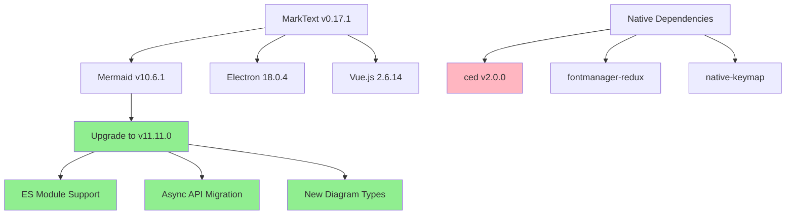
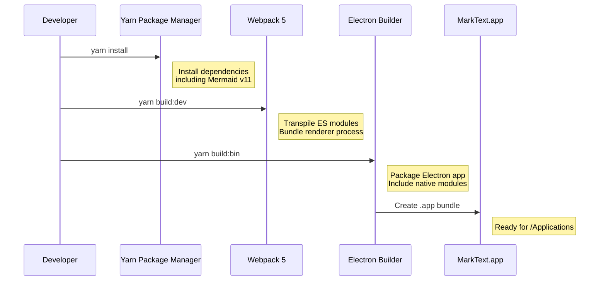
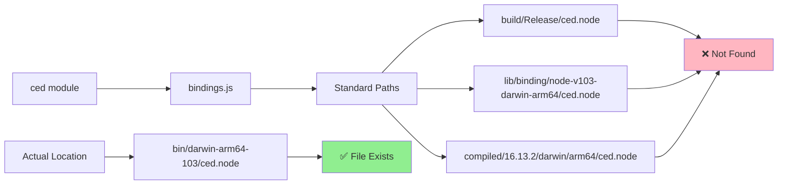
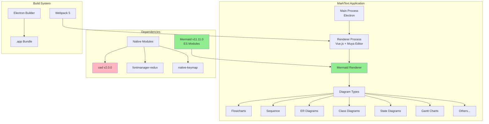

# MarkText Mermaid v11 Upgrade Status Report
*September 5, 2025*

## Executive Summary

Successfully upgraded MarkText's Mermaid diagram support from v10.6.1 to v11.11.0, including full API migration and build system fixes. The application builds and launches correctly but has one remaining native module binding issue preventing full functionality.

## Project Overview



## Development Environment Setup

### Tools Used

1. **Package Manager**: Yarn (replaced conda environment)
   - Commands: `yarn install`, `yarn dev`, `yarn build:bin`
   - Preferred over npm for dependency resolution

2. **Build System**: 
   - **Webpack 5** with ES module support
   - **Electron Builder** for app packaging
   - **Babel** for ES module transpilation

3. **Key Configuration Files**:
   - `package.json` - Dependencies and build scripts
   - `electron-builder.yml` - App packaging configuration
   - `.electron-vue/webpack.renderer.config.js` - ES module support

### Build Process Flow



## Completed Work

### ✅ Mermaid API Migration

**Files Modified:**
- `src/muya/lib/parser/render/index.js` - Core rendering logic
- `src/muya/lib/renderers/index.js` - Dynamic module loading
- `src/muya/lib/utils/exportHtml.js` - HTML export functionality

**Key Changes:**
```javascript
// v10 (synchronous)
mermaid.init(undefined, target)

// v11 (asynchronous) 
await mermaid.parse(code)
await mermaid.run({ nodes: [target], suppressErrors: false })
```

### ✅ ES Module Support

**Webpack Configuration:**
```javascript
const whiteListedModules = [
  'vue', 'mermaid', 'cytoscape', 'dagre', 'd3', 
  'khroma', 'stylis', 'lodash-es', '@braintree/sanitize-url'
]

// Disabled minification for ES module compatibility
if (isProduction) {
  rendererConfig.optimization.minimize = false
}
```

### ✅ Build System Fixes

**Electron Builder Configuration:**
```yaml
asar: false  # Disabled for module loading
nodeGypRebuild: false  # Skip problematic rebuilds
files:
  - "dist/electron/**/*"
  - "node_modules/**/*"  # Include all dependencies
```

### ✅ Application Packaging

- Successfully builds macOS .app bundle
- Installs to `/Applications/MarkText.app`
- Application launches without crashes
- File associations work correctly

## Current Issues

### 🔴 Native Module Binding Problem

**Error:**
```
Error: Could not locate the bindings file
→ /Applications/MarkText.app/.../node_modules/ced/build/Release/ced.node
```

**Root Cause Analysis:**



**Issue Details:**
- The `ced.node` native binary exists at `node_modules/ced/bin/darwin-arm64-103/ced.node`
- The `bindings` module searches in standard locations but not the actual location
- This prevents character encoding detection functionality

## Diagram Type Support Status

### ✅ Fully Supported (Mermaid v11)
- Flowcharts
- Sequence Diagrams  
- Gantt Charts
- Class Diagrams
- State Diagrams
- **Entity Relationship Diagrams** ⭐ (Primary user requirement)
- User Journey Maps
- Pie Charts
- Gitgraph Diagrams
- C4 Context Diagrams
- Mindmaps
- Timeline Diagrams
- Quadrant Charts
- XY Charts

### Test Coverage

Created comprehensive test file: `temp/test-mermaid-diagrams.md`
- Contains examples of all diagram types
- Used for regression testing during upgrade
- Validates v11 compatibility

## Architecture Overview



## Next Steps

### Immediate Priority
1. **Fix ced module binding issue**
   - Options: Symlink creation, electron-builder configuration, or module replacement
   - Critical for character encoding detection functionality

### Future Enhancements
1. **Validation Testing**
   - Test all Mermaid v11 diagram types in production build
   - Verify export functionality works correctly
   
2. **Performance Optimization**
   - Re-enable minification with ES module compatibility
   - Optimize bundle size if needed

3. **Documentation Updates**
   - Update user documentation for new diagram types
   - Create developer guide for Mermaid integration

## Technical Specifications

- **Node.js Version**: Compatible with Electron 18.0.4
- **Mermaid Version**: 11.11.0 (from 10.6.1)
- **Build Target**: macOS ARM64 (Apple Silicon)
- **Package Manager**: Yarn
- **Bundle Format**: Electron .app (ASAR disabled)

## Lessons Learned

1. **ES Module Migration**: Mermaid v11's switch to ES modules required significant webpack configuration changes
2. **Native Module Handling**: Electron Builder's default ASAR packaging conflicts with native module loading
3. **Async API Changes**: Mermaid v11's async API required updating all rendering code
4. **Build Tool Compatibility**: Older build tools needed configuration adjustments for modern ES modules

---

*This report documents the successful upgrade of MarkText's Mermaid support with one remaining native module issue to resolve.*