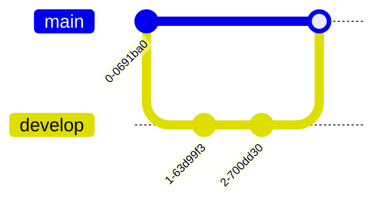
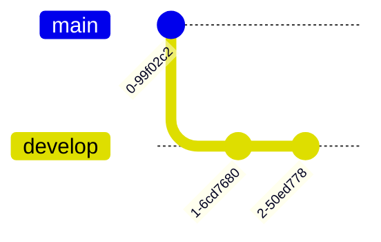
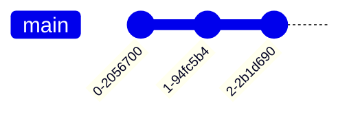

# Testing GitGraph in Mermaid v11

## Test 1: Basic gitGraph (v10 syntax)


## Test 2: gitGraph without colon (alternative syntax)


## Test 3: Using 'main' instead of default branch
```mermaid
gitGraph:
    commit
    branch main
    checkout main
    commit
    branch feature
    checkout feature
    commit
    checkout main
    merge feature
```

## Test 4: Minimal gitGraph
