# Mermaid Diagram Tests in MarkText

## Entity Relationship Diagram (ER Diagram)

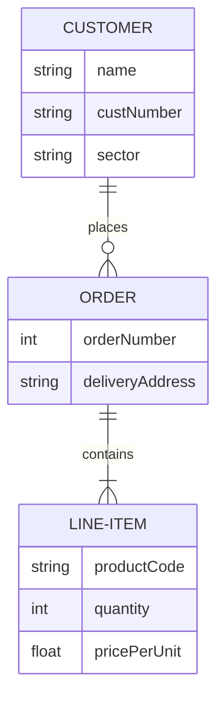

## Class Diagram

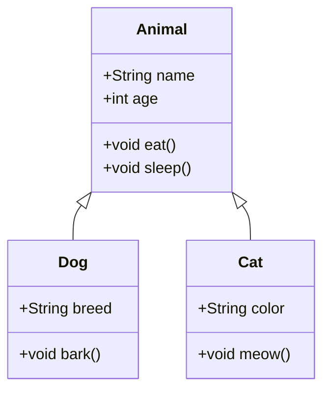

## State Diagram

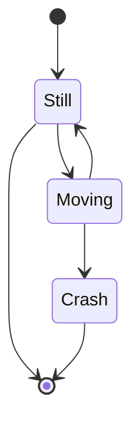

## Gantt Chart

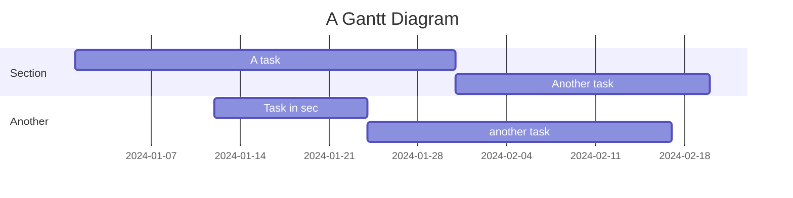

## User Journey

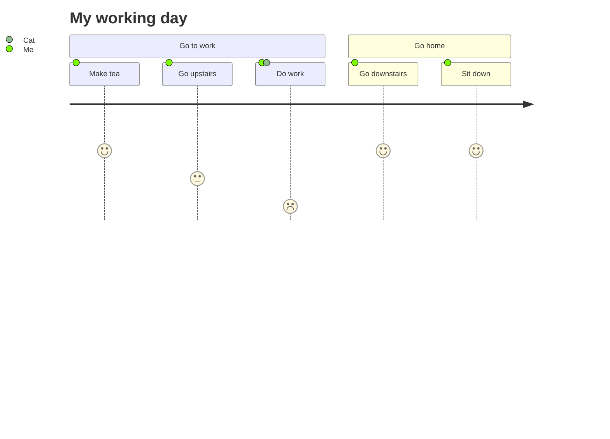

## Git Graph

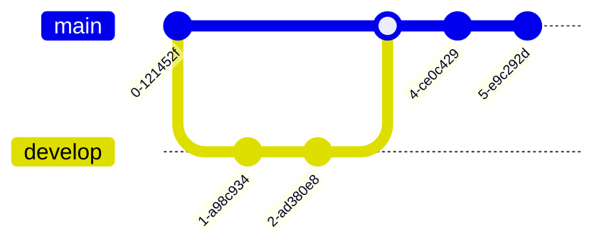

## Pie Chart

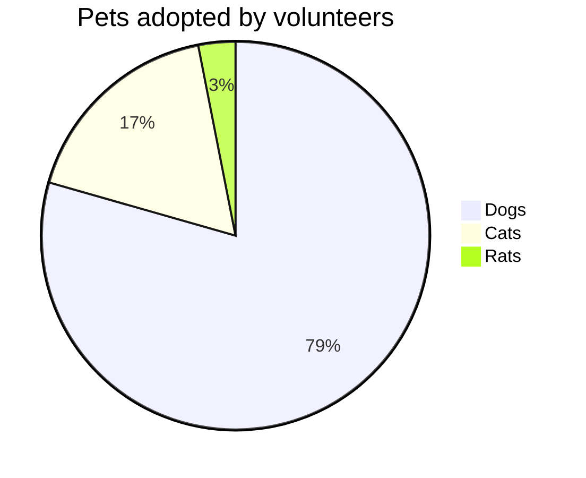

## Mindmap (Added in v10)

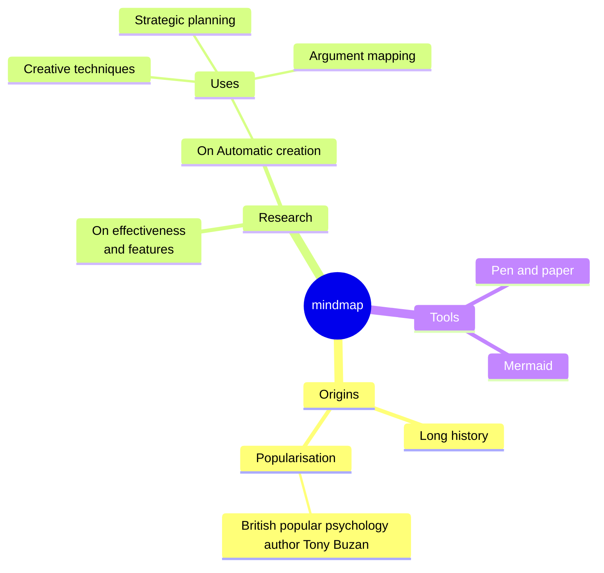

## C4 Context Diagram

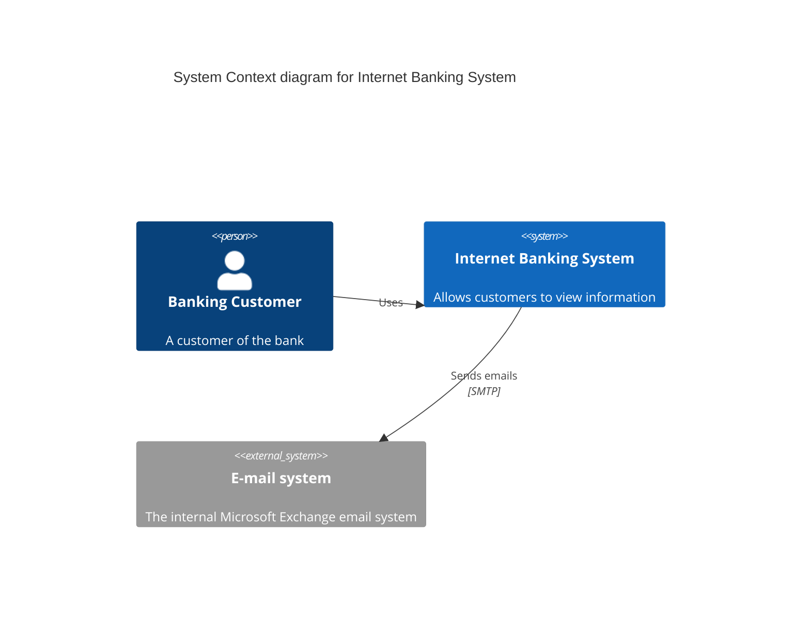

## Requirement Diagram

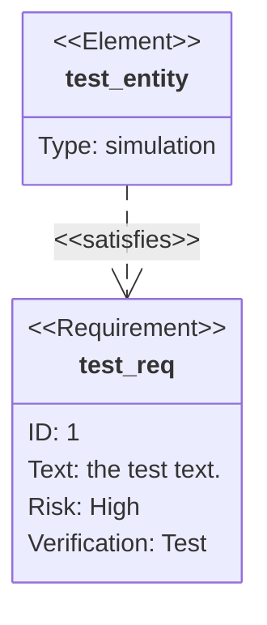

## Timeline (v10+)

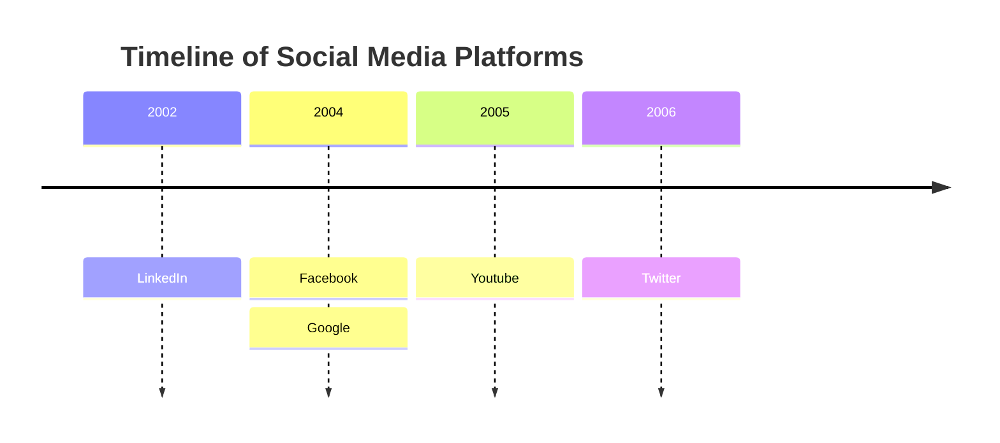

## Quadrant Chart (v10+)

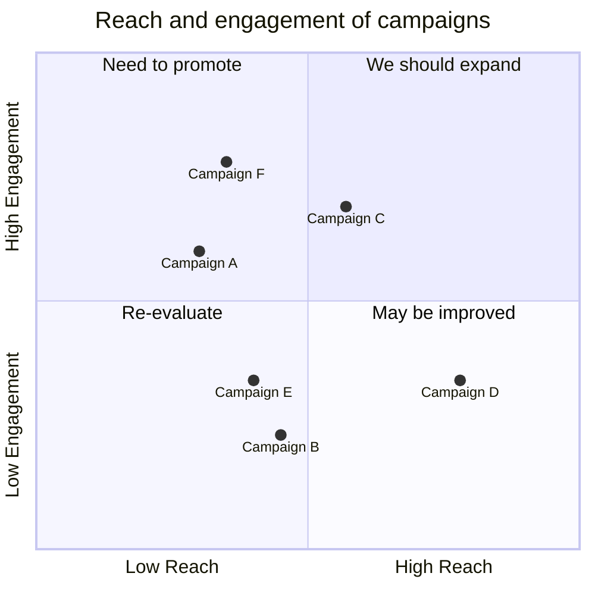

## XY Chart (v10.6+)

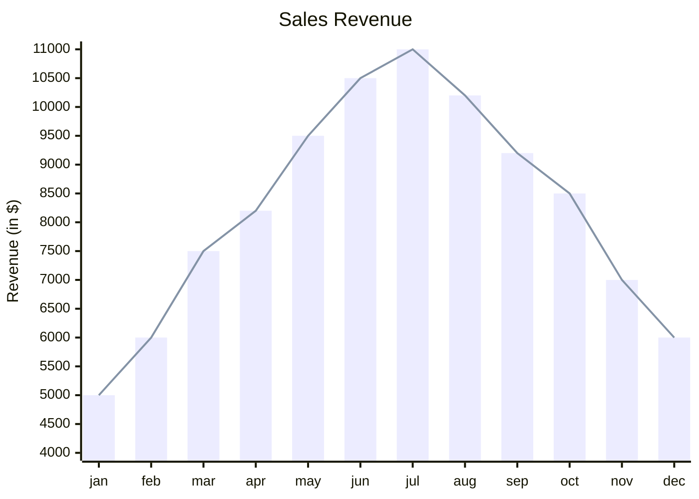

## Block Diagram (v10.6+)

```mermaid
block-beta
columns 3
  a:3
  block:alice:2
  c
  d
  e
```

## Sankey Diagram (v10.3+)

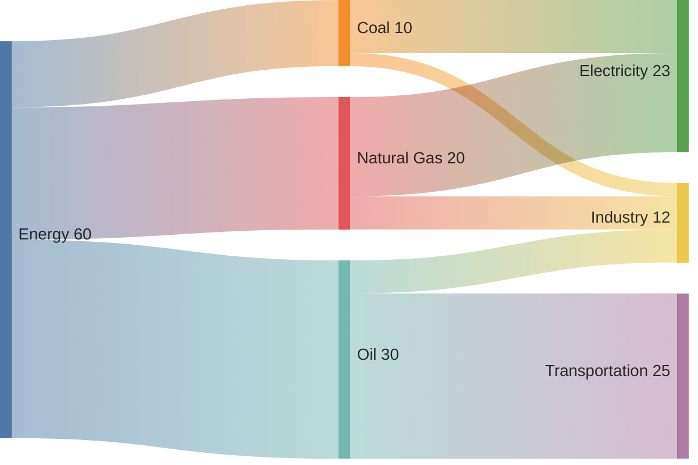

## Flowchart

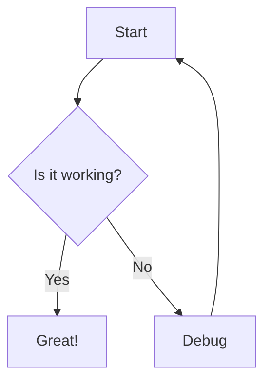

## Sequence Diagram

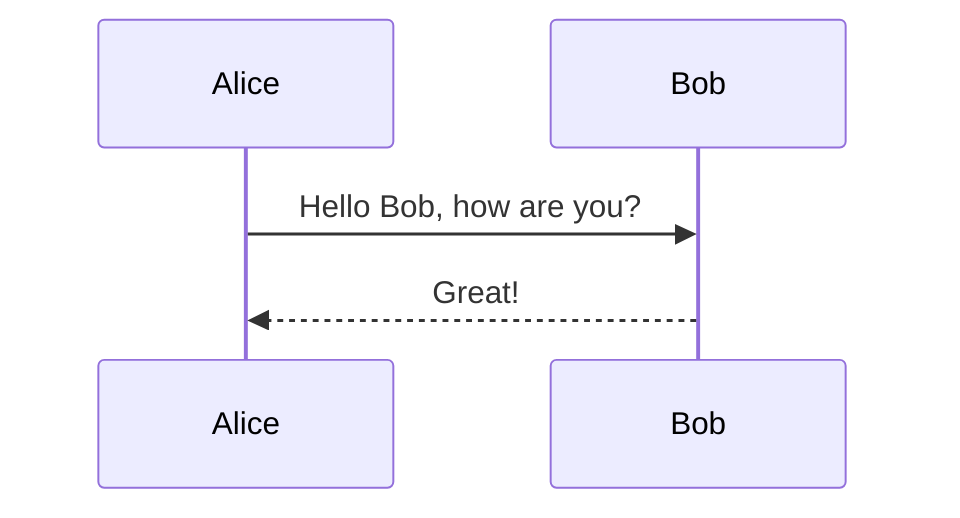