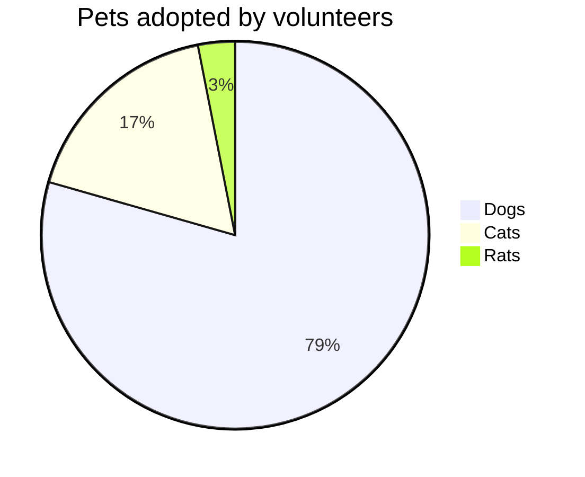
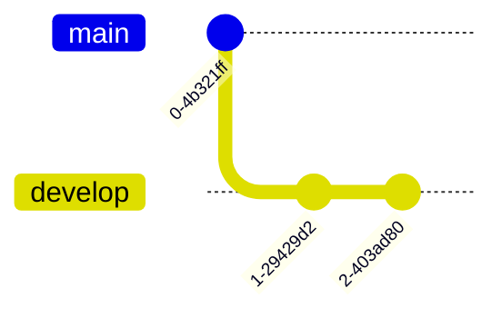
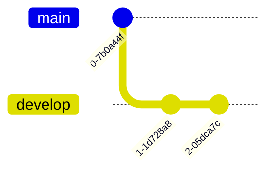
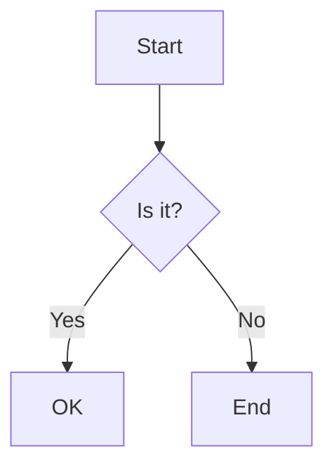

# Testing Problem Diagrams in Mermaid v11

## 1. Pie Chart


## 2. Block Diagram (Beta)
```mermaid
block-beta
columns 3
  a:3
  block:alice:2
  c
  d
  e
```

## 3. GitGraph


## 4. Alternative GitGraph with colon


## Working Reference - Flowchart
